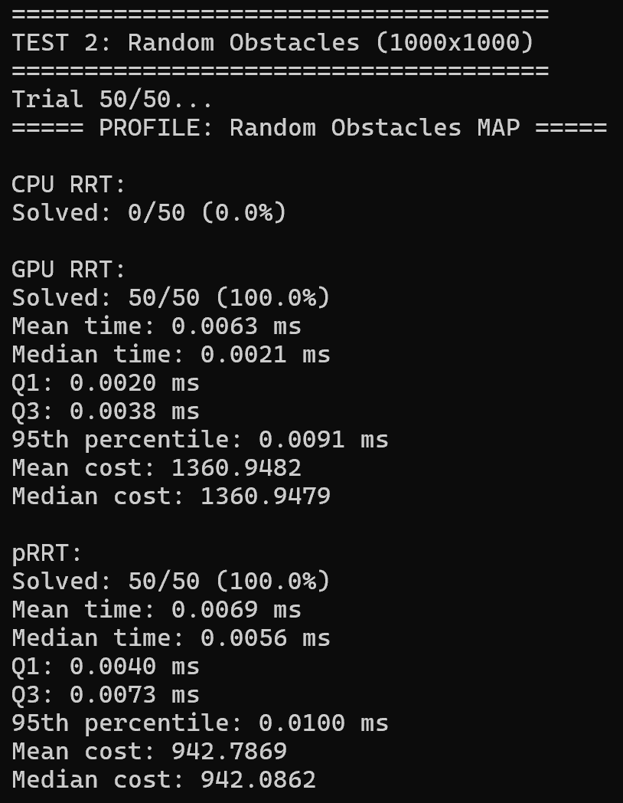
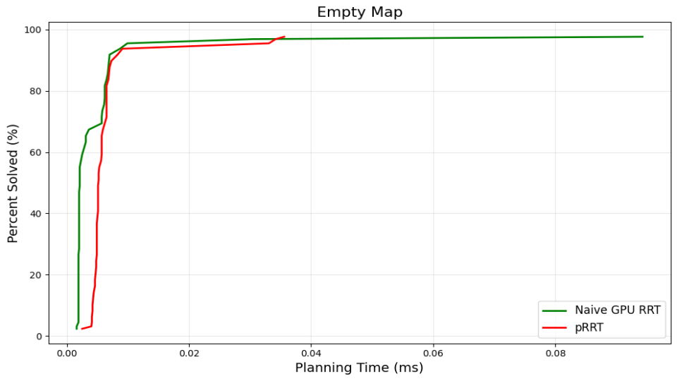
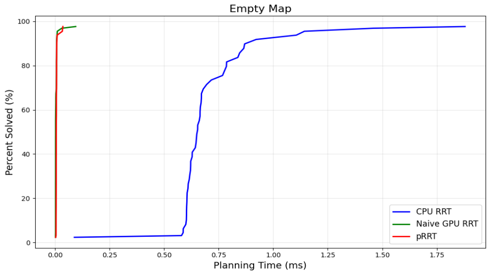
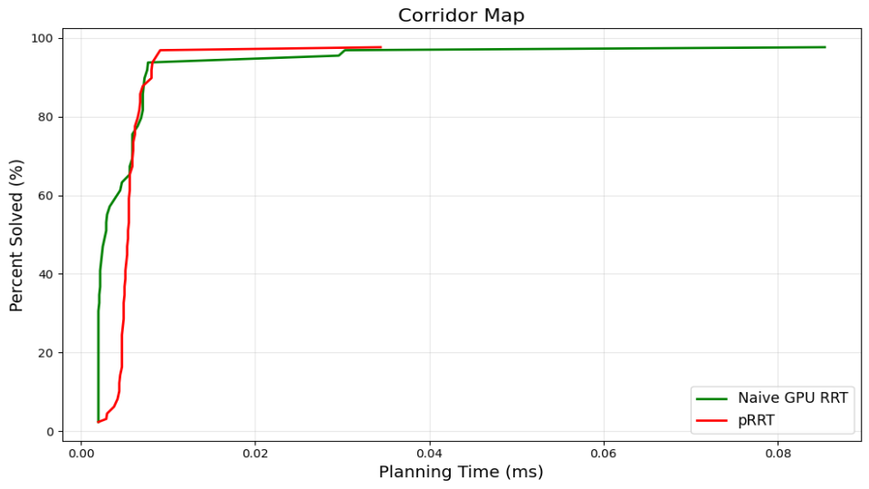
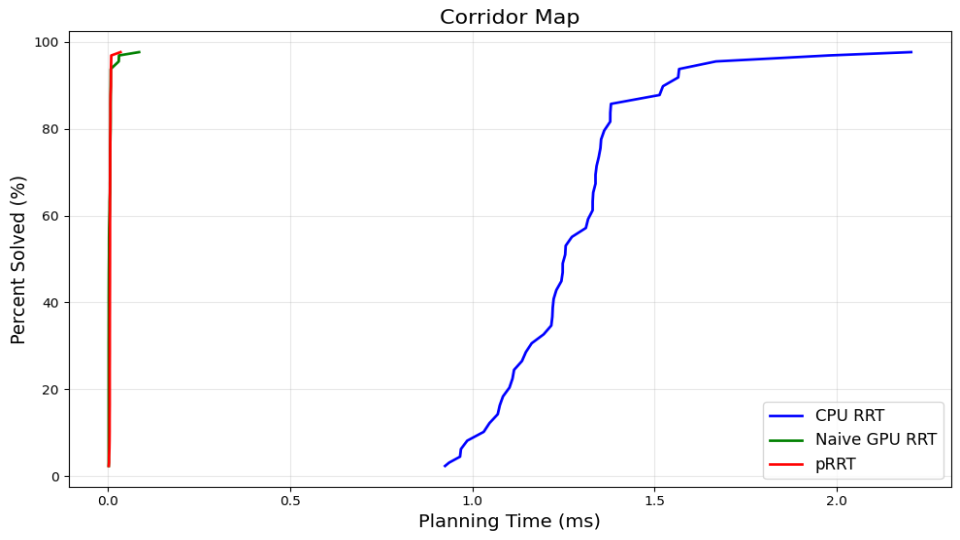
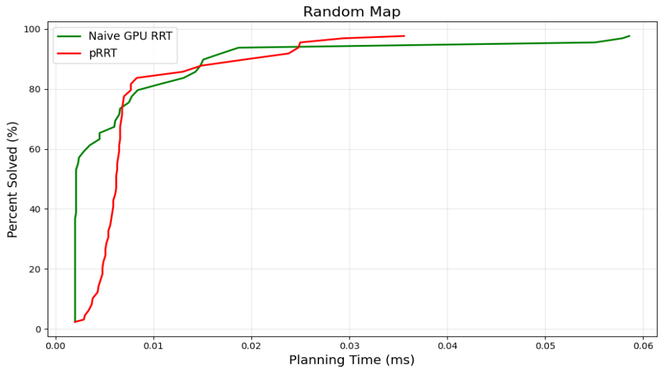
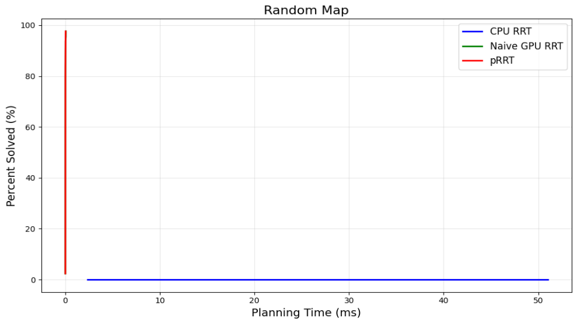
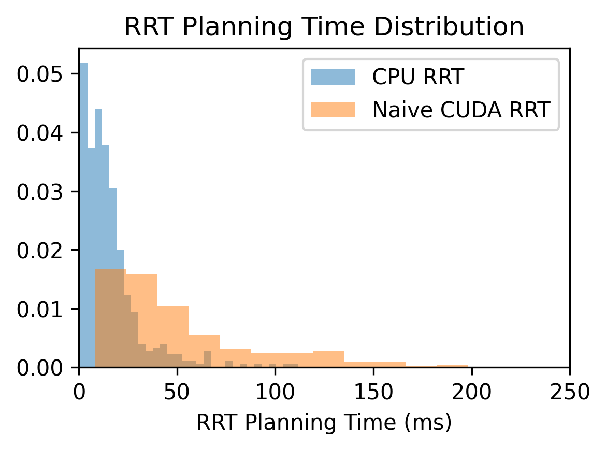
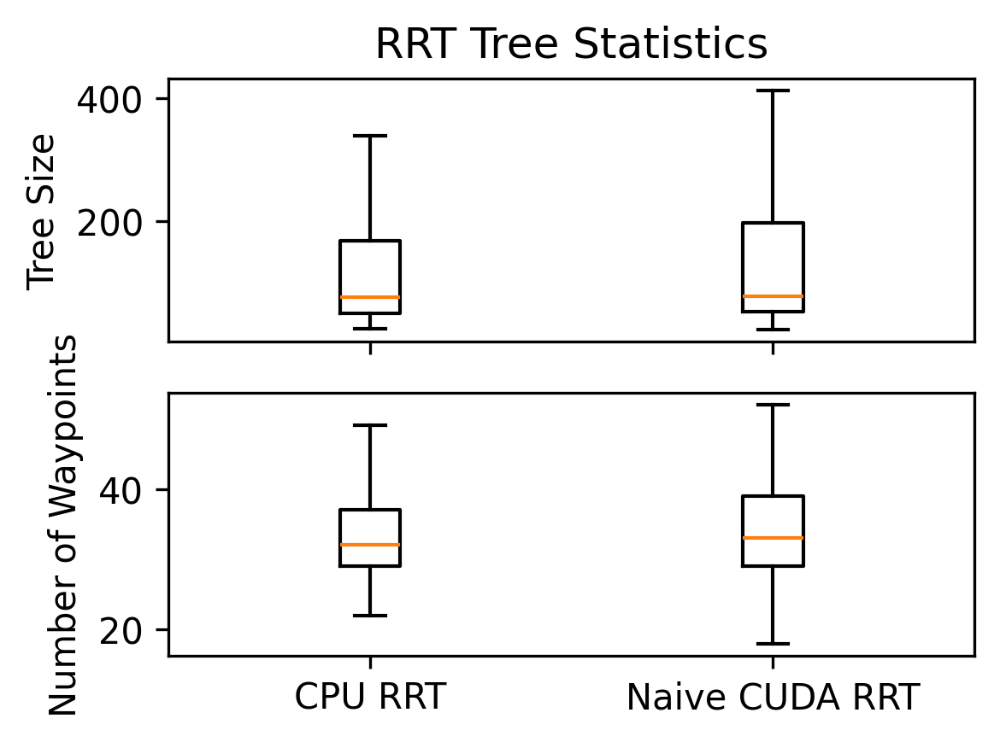

# GPUDynamicRRT

CIS 5650 Final Project

* Zwe Tun
  * LinkedIn: <https://www.linkedin.com/in/zwe-tun-6b7191256/>
* Jefferson Koumba Moussadji Lu
* Yunhao Qian
  * LinkedIn: <https://www.linkedin.com/in/yunhao-qian-026980170/>

* Tested on: Intel(R) i7-14700HX, 2100 Mhz, RTX 5060 Laptop

## Project Overview

GPUDynamicRRT is a robotics project aiming to build a GPU-accelerated Rapidly-Exploring Random Tree (RRT) path planner for an autonomous F1Tenth racecar platform. The goal is to enable real-time path planning in environments with dynamic obstacles, leveraging GPU parallelism to outperform traditional CPU-based RRT planners. RRT is a sampling-based algorithm widely used for robot path planning. By offloading RRT computations to the car's onboard NVIDIA GPU, the planner can handle frequent re-planning and avoid moving obstacles without slowing down the vehicle. This project integrates the GPU-based RRT with the F1Tenth simulator and hardware, demonstrating improved performance and responsiveness compared to a CPU implementation.

  
  
RRT on the F1tenth car vs RRT in simulation

## Motivation

In a dynamic racing environment, obstacles (like other vehicles or moving pedestrians) can appear or move unpredictably. A CPU-based RRT planner might struggle to re-plan fast enough to avoid collisions or might produce suboptimal paths due to limited sampling speed. By using a GPU, our planner can generate and evaluate far more samples in the same timeframe, greatly increasing the chances of finding a safe, optimal path quickly. The intended advantage is a significant boost in planning frequency and reliability. The GPU implementation should maintain real-time performance where the CPU version could lag or fail to find a path in time. Ultimately, this means the F1Tenth car can drive faster and more safely through dynamic courses, as the planner can continuously update the trajectory on the fly.

## Project Structure

The project is organized into several components, each corresponding to a ROS package or module in the codebase:

* `GPU-RRT`: A CUDA-based implementation of the RRT algorithm, which offloads tree expansion and collision-checking computations to the GPU for speed.
* `f1tenth_gym_ros`: An interface node (sourced from the official F1Tenth simulator repository) that connects our planning algorithm with the F1Tenth Gym simulation environment. This ROS node publishes sensor data and receives drive commands, acting as the bridge between the RRT planner and the simulator.
[F1tenth Gym ROS official link](https://github.com/f1tenth/f1tenth_gym_ros)
* `lab7_pkg`: A ROS package containing a baseline Python implementation of the RRT planner and a pure-pursuit waypoint follower. The Python RRT (from a previous lab) runs on the CPU and serves as a reference for correctness and performance comparison.
* `cpu_rrt`:A ROS package containing a C++ implementation of the RRT algorithm. This CPU version is more optimized than the Python one and is used to benchmark against the GPU version in terms of speed and efficiency.

Additionally, the project's development environment has been containerized for consistency and ease of use. Some parts of the code and build configuration are maintained in a separate branch. For example, the `2025-11-13` branch includes a Docker Compose setup that stitches together all the required components (ROS master, simulator, planner nodes, etc.) for easy simulation and testing. By using Docker, developers and contributors can replicate the exact software environment (ROS, CUDA, dependencies) without manual installation, and launch the entire simulation with a single command.

# Development Environment & System Architecture

   
  
F1tenth car hardware overview

  
  
Overview of the development and run-time architecture in GPUDynamicRRT

Each major component of the system is implemented as a separate ROS node (process), which communicate through ROS topics. For instance, the RRT planning algorithm publishes the planned path (waypoints) to a topic that the Pure Pursuit controller listens to, while the simulator provides sensor updates (like LiDAR scans or odometry) to the planner. The diagram illustrates how these nodes (GPU-RRT planner, CPU planner, waypoint tracker, F1Tenth simulator, etc.) are connected. Because each ROS node runs as its own process, the system takes advantage of multi-core CPUs and the GPU concurrently. We have containerized this environment to simplify setup: using Docker ensures all dependencies (ROS 2, CUDA libraries, etc.) are properly installed, and it enables one-command launch of the full simulation. This cleaned-up development environment makes it easier for multiple team members to develop and test the planner in a consistent setup across different machines.

## GPU RRT Implementation Details

The core of this project is the GPU-accelerated RRT algorithm. In the current implementation (Milestone 2), we adopted a "naive" parallelization approach to quickly leverage the GPU’s capabilities. The naive GPU RRT runs many RRT iterations in parallel: essentially, multiple random explorations are started simultaneously, each handled by a separate GPU thread or block. This approach increases the chance of finding a viable path quickly, as one of the many parallel trees is likely to reach the goal faster than a single-threaded tree would. Once any thread's RRT finds a path to the goal, the result is returned and used for the vehicle’s trajectory.

  
  
CUDA RRT - Current Approach vs. Final Goal

The diagram contrasts our current GPU RRT strategy (left) with the fully parallel algorithm we ultimately aim to implement (right). In the current approach, each GPU thread (or group of threads) builds its own RRT independently (Tree 0, Tree 1, ..., Tree N in parallel). After a fixed number of iterations or when one thread’s tree finds the goal, the planner performs a gather operation to pick the successful path. This brute-force parallelism yields a faster result by running many RRTs concurrently, but it does redundant work. In the final planned approach, all threads will cooperate on a single RRT. Threads will work in parallel on different parts of the tree growth within each iteration (for example, evaluating multiple new sample points or checking collisions simultaneously), then synchronize (gather) at each step. This way, the algorithm efficiently expands one search tree with full parallelism, rather than many separate trees. The cooperative approach is more complex but will eliminate wasted effort and handle dynamic obstacle updates more gracefully, as the single shared tree can be quickly adjusted when the environment changes.

## Performance Evaluation

A key objective of this project is to quantify the speed-up achieved through GPU acceleration. Even with our initial naive GPU implementation, the performance benefits can already been seen when compared to a single-threaded CPU RRT baseline.

  
  
  

  
  
Different paths plotted by each RRT algorithm

### Overview of Performance Metrics

To evaluate planning performance across different planners and environments, we use the following metrics:

1. Planning Time (ms)
The mean and medium planning time of the algorithm to produce a valid path form start to goal.

2. Cost of the Path
The total distance of the resulting path from start to goal.

3. Solve Percentage (Success Rate)
The percentage of trials in which a valid path is found within a time/iteration budget.

4. Percentile
The variability in runtime. Q1 is 25th percentile, Q3 is 75th percentile. The 95th percentile is of note to show that 95% of runs finished at or faster than this time, characterizing the “worst typical case."

5. CDF (Cumulative Distribution Function) of Planning Time
CDF curves allow comparison not just of average speed, but distributional speed characteristics:
Farther left = faster solve times.
Steeper slope = more consistent solve times.
Higher tail = greater variance. 
These plots mirror evaluation methods used in sampling-based planning research papers.

| Map Type (width, height) | Visualizations |
|----------|----------------|
| **Empty Map (100 × 100)** |   |
| **Corridor Map (60 × 120)** |   |
| **Random Map (1000 × 1000)** |   |

*CPU RRT failed all trials of random map resulting in flat line*

## Data Collected from Deployment

To evaluate a naive GPU baseline, we implemented a multi-tree RRT planner that is logically identical to our multi-threaded CPU implementation. The common RRT logic is factored into a shared header and compiled separately for CPU and CUDA. In all experiments, we use the same RRT configuration; the CPU version runs with 2 worker threads, and the CUDA version launches 32 workers in parallel. We deploy both planners on the vehicle and collect statistics over two complete test loops.

In terms of planning latency, the CPU implementation is significantly faster. On average, the CPU planner completes in about 20 ms, whereas the CUDA planner requires roughly 40 ms per invocation. This is expected: for a single sequential workload, an individual CPU core is much more powerful than a single CUDA core, and our GPU implementation is essentially a direct port of the CPU code. Additionally, kernel launch overhead and host–device data movement further reduce the benefit of parallelizing independent RRT instances on the GPU.

For successful planning attempts, the structure of the resulting paths is similar if not identical. The distribution of tree sizes is slightly larger for CUDA than for CPU, while the number of waypoints in the final path is very close between the two. This is consistent with both planners using the same sampling strategy, termination conditions, and per-tree node limits, with the GPU spending somewhat more effort per successful tree.

The main difference is in success rate. The CPU planner succeeds in approximately 82 % of planning attempts, whereas the naive CUDA planner succeeds only about 68 % of the time. Increasing the number of GPU workers from 2 to 32 does not significantly increase the probability of finding a path. At the worker level, we typically observe that in a given planning episode either almost all workers succeed or almost all fail, suggesting that each planning problem is effectively near-binary—either easy enough that many independent trees succeed, or difficult enough that additional workers provide little help.

Several factors contribute to this behavior. First, planning latency in a dynamic environment matters: both planners are triggered at the same callback frequency, but the vehicle continues to move while planning is in progress. Because the CPU planner finishes in roughly 20 ms and the CUDA planner in roughly 40 ms, the CPU’s RRT tree is built with environment information closer to the state at which its waypoints will be executed. The CUDA planner, by contrast, more often plans on slightly stale information, making it more likely to produce paths that are misaligned with the true current state and that lead to harder configurations in subsequent cycles.

Second, there is resource contention with the particle filter used for localization. On our platform, the GPU is shared between the CUDA RRT and a particle filter that estimates the vehicle’s pose. Moving RRT from CPU to GPU reduces the resources available to the particle filter and may degrade the precision or freshness of the pose estimate, further amplifying the misalignment between planned paths and the true state. Due to operating system constraints on the vehicle, we cannot directly profile the GPU to quantify this effect, but it is a plausible contributor.

Third, per-tree node budget remains a key determinant of success. For a fixed planning time, more nodes in a single tree increase coverage and density, improving the chance of connecting start and goal in cluttered environments. In the naive multi-tree CUDA design, the computational budget is spread across many independent trees, each relatively small. Given the near-binary nature of success in our scenarios, simply running more small trees in parallel does little to change the underlying probability that any one tree will find a solution.

At the system level, the planner is allowed up to three retries before sending an updated waypoint sequence to the pure-pursuit controller. This yields an overall success rate of nearly 97 % at the controller interface, even though the per-attempt success rates differ substantially between CPU and CUDA. Thus, the naive CUDA implementation is not constantly failing to provide a path. However, because its plans are more likely to be based on stale or less accurate information, they tend to steer the vehicle into more constrained and difficult situations. In practice, we observe more accidental crashes and near-collisions with the naive CUDA planner, even when it technically finds a path.

These observations indicate that a naive multi-tree CUDA implementation is poorly matched to our application. Although it performs more parallel computations than the CPU baseline, this does not translate into higher effective success or improved safety, because the dominant factors are planning latency, pose estimation quality, and per-tree node density, rather than the sheer number of independent trees. This motivates an algorithmic redesign: in pRRT, multiple CUDA threads cooperatively grow a single RRT tree (or a small set of trees), increasing the number of nodes per tree and reducing effective latency, thereby better exploiting the GPU’s parallel capabilities.

**Meeting Notes 11/09/25**

Initial f1tenth gym setup on personal laptops.
<https://github.com/f1tenth/f1tenth_gym_ros/tree/dev-dynamics-temporary-documentation>

Electrical Hardware Overview Walkthrough

* 2D Lidar Scanner
* Nividia Orin Nano
* Lipo Battery
