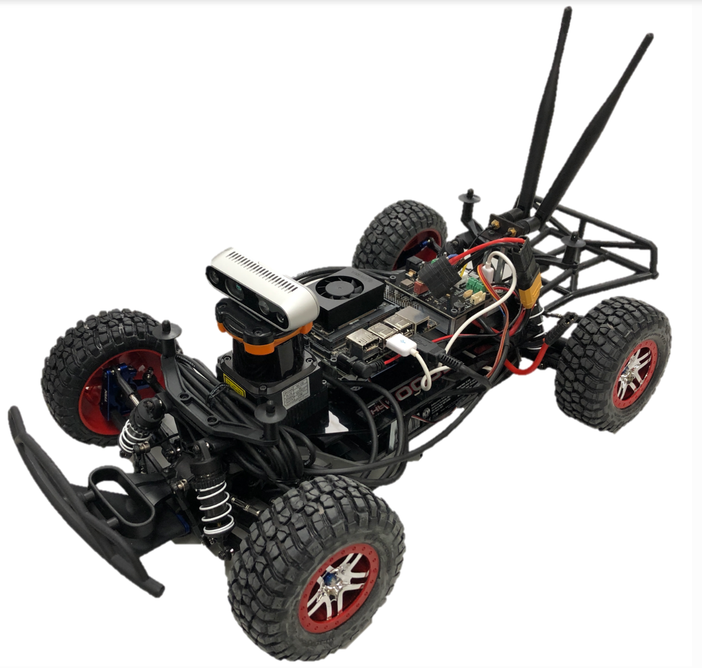
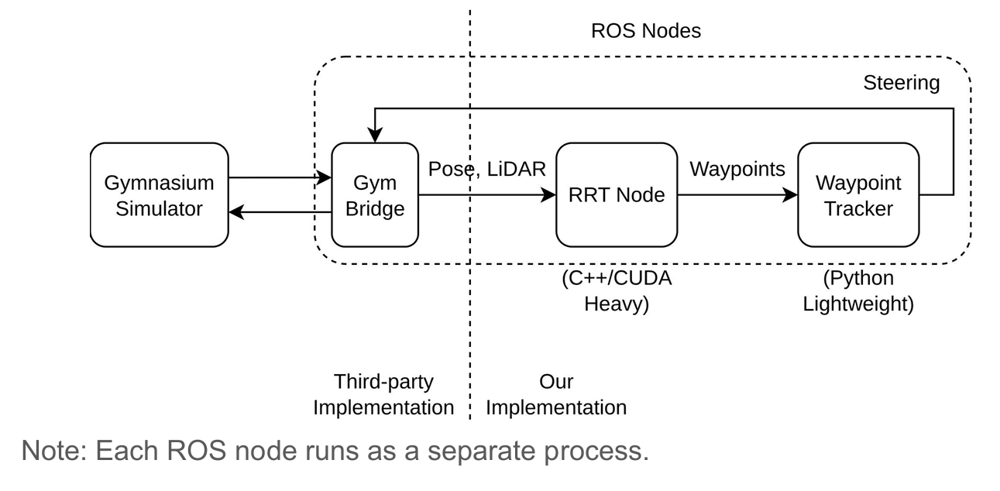
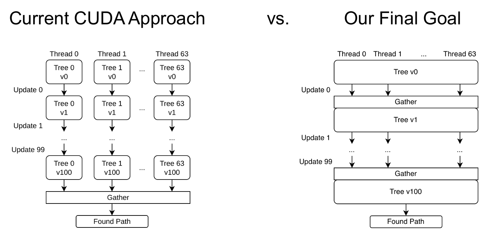
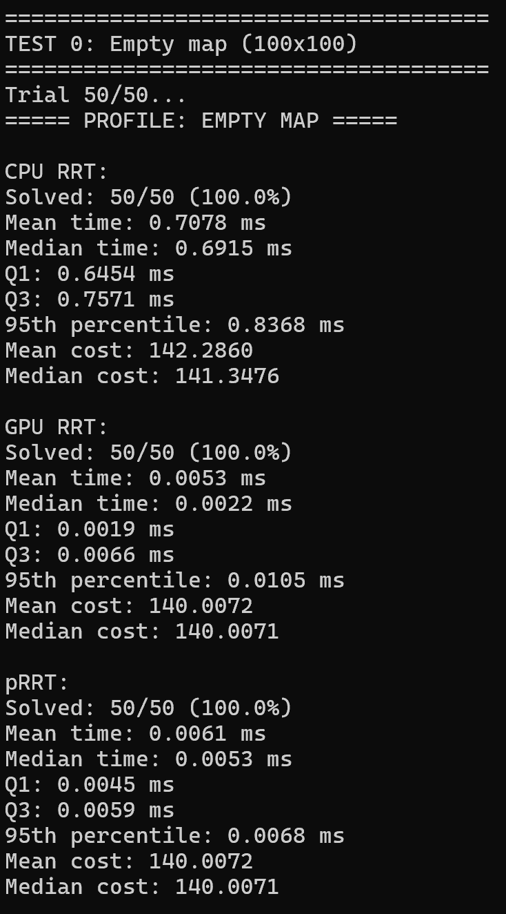
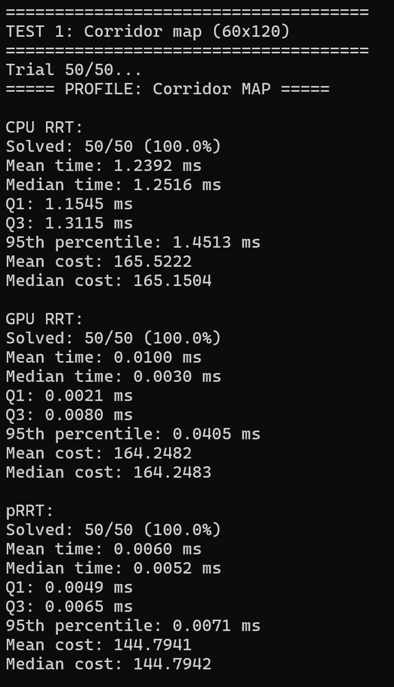
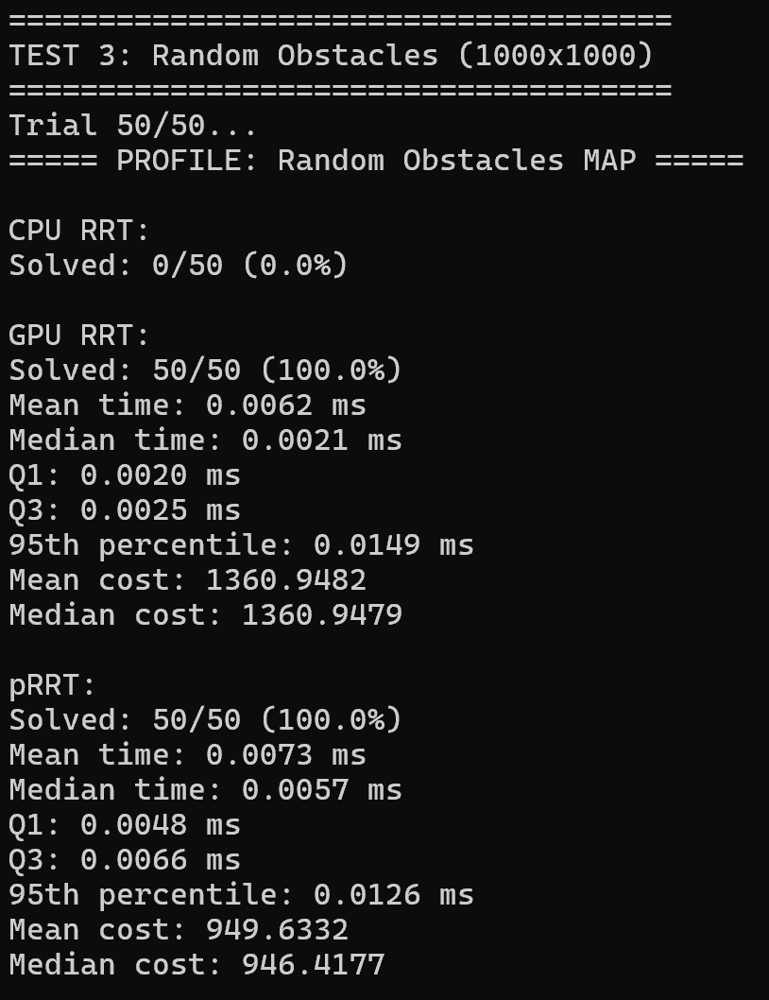
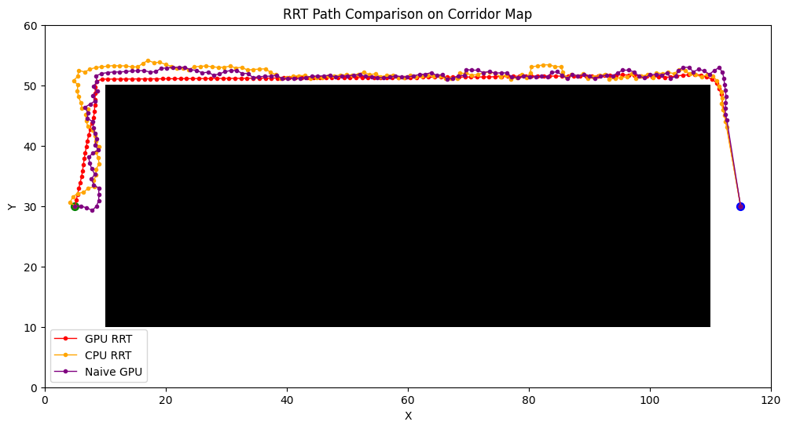

# GPUDynamicRRT

CIS 5650 Final Project

* Zwe Tun
  * LinkedIn: https://www.linkedin.com/in/zwe-tun-6b7191256/
* Jefferson Koumba Moussadji Lu
* Yunhao Qian
  
* Tested on: Intel(R) i7-14700HX, 2100 Mhz, RTX 5060 Laptop
## Project Overview

GPUDynamicRRT is a robotics project aiming to build a GPU-accelerated Rapidly-Exploring Random Tree (RRT) path planner for an autonomous F1Tenth racecar platform. The goal is to enable real-time path planning in environments with dynamic obstacles, leveraging GPU parallelism to outperform traditional CPU-based RRT planners. RRT is a sampling-based algorithm widely used for robot path planning. By offloading RRT computations to the car's onboard NVIDIA GPU, the planner can handle frequent re-planning and avoid moving obstacles without slowing down the vehicle. This project integrates the GPU-based RRT with the F1Tenth simulator and hardware, demonstrating improved performance and responsiveness compared to a CPU implementation.

  
  
RRT on the F1tenth car vs RRT in simulation

## Motivation

In a dynamic racing environment, obstacles (like other vehicles or moving pedestrians) can appear or move unpredictably. A CPU-based RRT planner might struggle to re-plan fast enough to avoid collisions or might produce suboptimal paths due to limited sampling speed. By using a GPU, our planner can generate and evaluate far more samples in the same timeframe, greatly increasing the chances of finding a safe, optimal path quickly. The intended advantage is a significant boost in planning frequency and reliability. The GPU implementation should maintain real-time performance where the CPU version could lag or fail to find a path in time. Ultimately, this means the F1Tenth car can drive faster and more safely through dynamic courses, as the planner can continuously update the trajectory on the fly.

## Project Structure

The project is organized into several components, each corresponding to a ROS package or module in the codebase:

- `GPU-RRT`: A CUDA-based implementation of the RRT algorithm, which offloads tree expansion and collision-checking computations to the GPU for speed.
- `f1tenth_gym_ros`: An interface node (sourced from the official F1Tenth simulator repository) that connects our planning algorithm with the F1Tenth Gym simulation environment. This ROS node publishes sensor data and receives drive commands, acting as the bridge between the RRT planner and the simulator. 
[F1tenth Gym ROS official link](https://github.com/f1tenth/f1tenth_gym_ros)
- `lab7_pkg`: A ROS package containing a baseline Python implementation of the RRT planner and a pure-pursuit waypoint follower. The Python RRT (from a previous lab) runs on the CPU and serves as a reference for correctness and performance comparison.
- `cpu_rrt`:A ROS package containing a C++ implementation of the RRT algorithm. This CPU version is more optimized than the Python one and is used to benchmark against the GPU version in terms of speed and efficiency.

Additionally, the project's development environment has been containerized for consistency and ease of use. Some parts of the code and build configuration are maintained in a separate branch. For example, the `2025-11-13` branch includes a Docker Compose setup that stitches together all the required components (ROS master, simulator, planner nodes, etc.) for easy simulation and testing. By using Docker, developers and contributors can replicate the exact software environment (ROS, CUDA, dependencies) without manual installation, and launch the entire simulation with a single command.

# Development Environment & System Architecture

   
  
F1tenth car hardware overview

  
  
Overview of the development and run-time architecture in GPUDynamicRRT

Each major component of the system is implemented as a separate ROS node (process), which communicate through ROS topics. For instance, the RRT planning algorithm publishes the planned path (waypoints) to a topic that the Pure Pursuit controller listens to, while the simulator provides sensor updates (like LiDAR scans or odometry) to the planner. The diagram illustrates how these nodes (GPU-RRT planner, CPU planner, waypoint tracker, F1Tenth simulator, etc.) are connected. Because each ROS node runs as its own process, the system takes advantage of multi-core CPUs and the GPU concurrently. We have containerized this environment to simplify setup: using Docker ensures all dependencies (ROS 2, CUDA libraries, etc.) are properly installed, and it enables one-command launch of the full simulation. This cleaned-up development environment makes it easier for multiple team members to develop and test the planner in a consistent setup across different machines.

## GPU RRT Implementation Details

The core of this project is the GPU-accelerated RRT algorithm. In the current implementation (Milestone 2), we adopted a "naive" parallelization approach to quickly leverage the GPU’s capabilities. The naive GPU RRT runs many RRT iterations in parallel: essentially, multiple random explorations are started simultaneously, each handled by a separate GPU thread or block. This approach increases the chance of finding a viable path quickly, as one of the many parallel trees is likely to reach the goal faster than a single-threaded tree would. Once any thread's RRT finds a path to the goal, the result is returned and used for the vehicle’s trajectory.

  
  
CUDA RRT - Current Approach vs. Final Goal

The diagram contrasts our current GPU RRT strategy (left) with the fully parallel algorithm we ultimately aim to implement (right). In the current approach, each GPU thread (or group of threads) builds its own RRT independently (Tree 0, Tree 1, ..., Tree N in parallel). After a fixed number of iterations or when one thread’s tree finds the goal, the planner performs a gather operation to pick the successful path. This brute-force parallelism yields a faster result by running many RRTs concurrently, but it does redundant work. In the final planned approach, all threads will cooperate on a single RRT. Threads will work in parallel on different parts of the tree growth within each iteration (for example, evaluating multiple new sample points or checking collisions simultaneously), then synchronize (gather) at each step. This way, the algorithm efficiently expands one search tree with full parallelism, rather than many separate trees. The cooperative approach is more complex but will eliminate wasted effort and handle dynamic obstacle updates more gracefully, as the single shared tree can be quickly adjusted when the environment changes.

## Performance Evaluation

A key objective of this project is to quantify the speed-up achieved through GPU acceleration. Even with our initial naive GPU implementation, the performance benefits can already been seen when compared to a single-threaded CPU RRT baseline.

  
  
  

  
  
Different paths plotted by each RRT algorithm

  
### Overview of Performance Metrics
To evaluate planning performance across different planners and environments, we use the following metrics:

1. Planning Time (ms)
The mean and medium planning time of the algorithm to produce a valid path form start to goal. 

2. Cost of the Path
The total distance of the resulting path from start to goal.

3. Solve Percentage (Success Rate)
The percentage of trials in which a valid path is found within a time/iteration budget.

4. Percentile
The variability in runtime. Q1 is 25th percentile, Q3 is 75th percentile. The 95th percentile is of note to show that 95% of runs finished at or faster than this time, characterizing the “worst typical case."

 
5. CDF (Cumulative Distribution Function) of Planning Time
CDF curves allow comparison not just of average speed, but distributional speed characteristics:
Farther left = faster solve times
Steeper slope = more consistent solve times
Higher tail performance = solves even the harder cases quickly
These plots mirror evaluation methods used in sampling-based planning research papers.

**Meeting Notes 11/09/25**

Initial f1tenth gym setup on personal laptops.
<https://github.com/f1tenth/f1tenth_gym_ros/tree/dev-dynamics-temporary-documentation>

Electrical Hardware Overview Walkthrough

- 2D Lidar Scanner
- Nividia Orin Nano
- Lipo Battery
